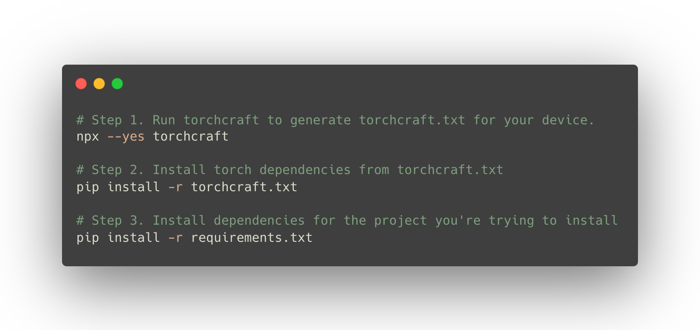
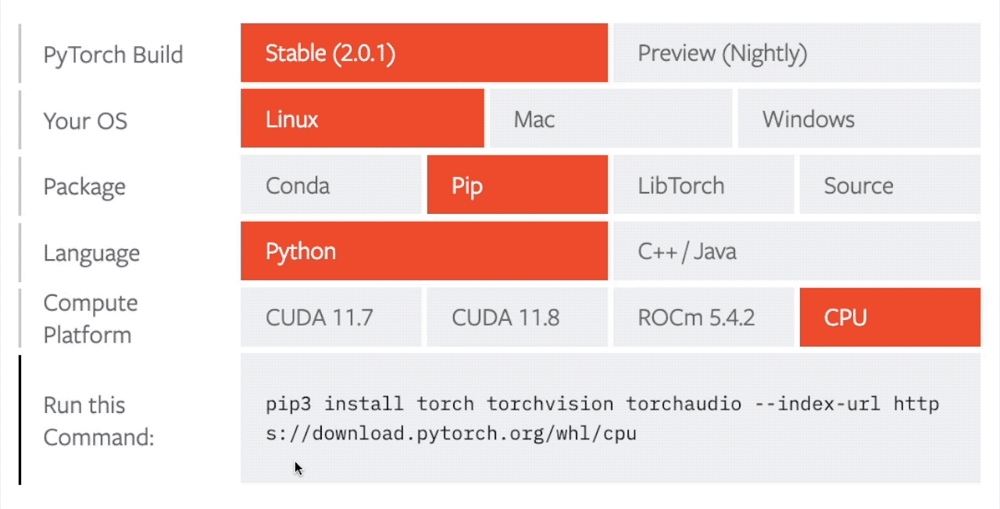

# Torchcraft

> "pip install torch" that JUST WORKS.



# Problem

Let's say we have the following `requirements.txt` file for a project you're trying to install:

```
# requirements.txt
numpy
sentencepiece
torch
torchaudio
huggingface_hub
transformers>=4.31.0  # need Encodec there.
xformers
gradio
```

If you install this with `pip install -r requirements.txt` without doing anything, it will probably install the `torch` that's not optimized for your system.

This may result in your project not taking advantage of your GPU at all, or not even run.

# The Old Way (manual)

The old way of installing pytorch is manually figuring out which version you can install for your device, and the figuring out the correct install command for your device.

The PyTorch site even has an interactive web app for this: https://pytorch.org/get-started/locally/



# The New Way (torchcraft)

But you really shouldn't have to do any of this manually. The computer already knows its own GPU and knows its own OS. It should be able to automatically figure out what install command to run.

And THIS, is what Torchcraft does. Torchcraft automates installation of Pytorch by automatically detecting:

- the OS (mac, windows, linux)
- the GPU (nvidia, amd, cpu) 

and then creating a `torchcraft.txt` file, which you can then install with `pip install -r torchcraft.txt`

# Usage

So in practice, how do you actually use Torchcraft?

Here's an example:

```
# Step 1. Run torchcraft to generate torchcraft.txt for your machine
npx --yes torchcraft

# Step 2. Install your device-optimized torch from torchcraft.txt
pip install -r torchcraft.txt

# Step 3. Install the dependencies for the project you're trying to install
pip install -r requirements.txt
```

This works because by the time we reach Step 3, the correct torch has been installed from step 1 and 2. And Step 3 will simply ignore all the torch related dependencies, saying **"Requirement already satisfied"**.

# How does it work?

1. All the template files for every combination of OS/GPU are under [requirements](requirements) folder.
2. When you run `npx torchcraft`, it detects the GPU/OS and copies the relevant requirements file in the requirements folder to the path you're running `npx torchcraft` from.
3. Now all you need to do is run `pip install -r torchcraft.txt`.

# Future Work

Currently torchcraft does not automatically detect the installed CUDA version or ROCm version. It instead generates the `torchcraft.txt` file by assuming the latest version of CUDA or ROCm.

This seems to work well (for example if my system has CUDA 102, installing the latest version (`--index-url https://download.pytorch.org/whl/cu118`) works. But if there is a practical issue with this approach, we could figure out a way to add a logic to programmatically determine the CUDA/ROCm version.

